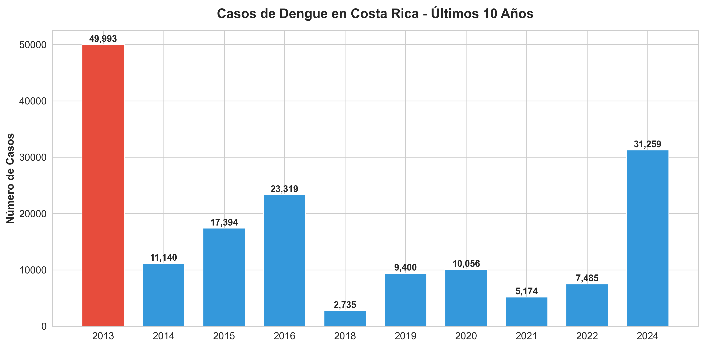
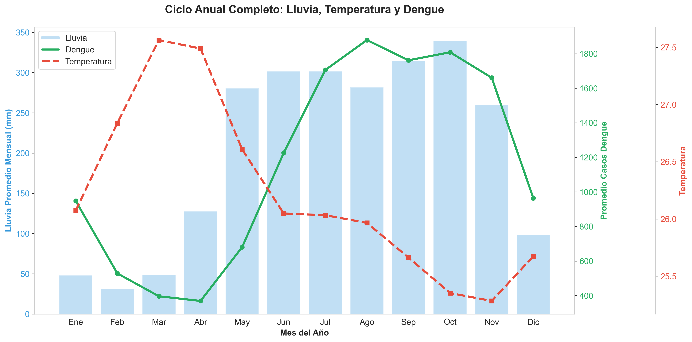
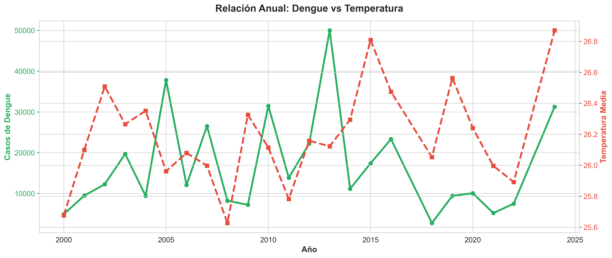
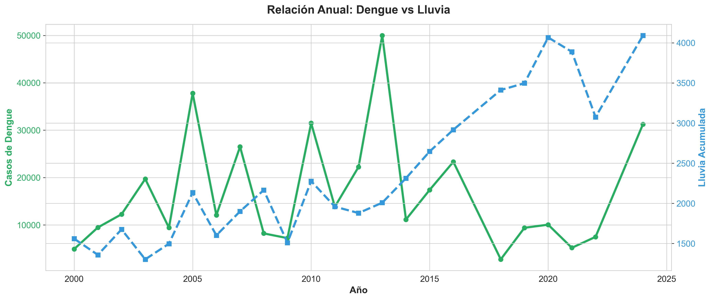
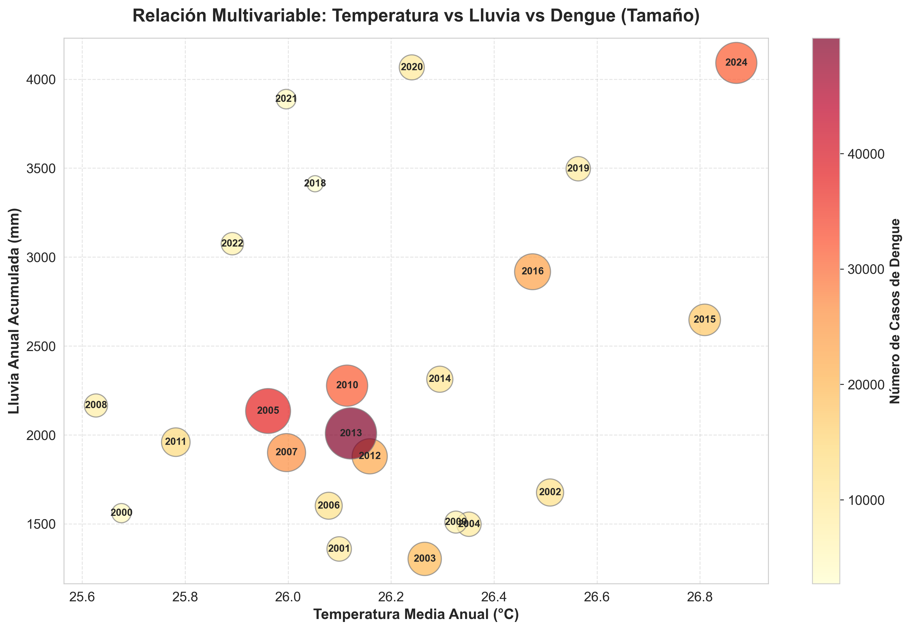

# Análisis de Casos de Dengue y Clima en Costa Rica

Este documento proporciona una guía para interpretar los gráficos generados y un análisis preliminar de los resultados obtenidos en el estudio de la relación entre el clima y los casos de dengue en Costa Rica.
# Paso1
````
python -m pip install --user pandas matplotlib seaborn
````
# Paso2
````
python script.py
````

# Análisis de Casos de Dengue y Clima en Costa Rica

Este documento proporciona una guía para interpretar los gráficos generados y un análisis preliminar de los resultados obtenidos en el estudio de la relación entre el clima y los casos de dengue en Costa Rica.

## 1. Guía de Lectura de Gráficos

A continuación se explica cómo leer e interpretar cada una de las visualizaciones generadas por el script:

### 📊 Gráfico 1: Casos de Dengue - Últimos 10 Años



- **Qué muestra:** Un gráfico de barras con la cantidad total de casos de dengue reportados en Costa Rica por año, enfocándose en la última década.
- **Cómo leerlo:**
  - Las barras más altas indican años epidémicos con brotes fuertes.
  - La barra roja resalta el año con el máximo histórico reciente.
  - Permite identificar rápidamente si la tendencia actual es al alza o a la baja.

### 🌦️ Gráfico 2: Patrón Estacional (Ciclo Anual)



- **Qué muestra:** El comportamiento promedio de las tres variables mes a mes (Enero a Diciembre).
  - **Barras Azules:** Lluvia promedio mensual (mm).
  - **Línea Verde:** Promedio de casos de dengue.
  - **Línea Roja:** Temperatura promedio.
- **Cómo leerlo:**
  - Este es clave para ver el **retardo (lag)**.
  - Fíjese si el pico de lluvias (barras azules altas) ocurre _antes_ o _durante_ el pico de casos (línea verde).
  - Generalmente, las lluvias aumentan la población de mosquitos, y unas semanas/meses después aumentan los casos.

### 📈 Gráfico 3: Relación Anual Dengue vs Temperatura



- **Qué muestra:** Compara la evolución año a año de los casos de dengue (línea verde) con la temperatura promedio anual (línea roja punteada).
- **Cómo leerlo:**
  - Busque **patrones paralelos**: ¿Cuando sube la temperatura (picos rojos), suben también los casos (picos verdes)?
  - Si las líneas se mueven juntas, sugiere una correlación positiva directa a nivel anual.

### 📈 Gráfico 4: Relación Anual Dengue vs Lluvia



- **Qué muestra:** Similar al anterior, pero compara casos de dengue (línea verde) con la lluvia total acumulada del año (línea azul punteada).
- **Cómo leerlo:**
  - Observe si los años más lluviosos coinciden con los años de más casos.
  - **Nota:** A veces la relación no es inmediata; mucha lluvia puede lavar criaderos, o sequía puede obligar a almacenar agua (creando criaderos).

### 🫧 Gráfico 5: Dispersión Multivariable (Burbujas)



- **Qué muestra:** Un mapa de "zonas de peligro".
  - **Eje X:** Temperatura.
  - **Eje Y:** Lluvia Anual.
  - **Tamaño/Color de Burbuja:** Cantidad de casos de dengue en ese año específico.
- **Cómo leerlo:**
  - Busque dónde se agrupan las burbujas más grandes y rojas.
  - Si las burbujas grandes están arriba a la derecha, significa que años más calientes y lluviosos producen más dengue.
  - Si están dispersas, la relación es más compleja.

---

## 2. Análisis Preliminar de Resultados

### ✅ ¿Qué se espera? (Interpretación del Contexto)

En el contexto epidemiológico de Costa Rica, se espera que el dengue tenga un comportamiento **estacional** y **cíclico**.

- **Estacional:** Aumentos de casos coincidiendo con la época lluviosa (mayo-noviembre), ya que el agua estancada favorece la reproducción del mosquito _Aedes aegypti_.
- **Cíclico:** Grandes epidemias cada 3-5 años debido a la inmunidad de rebaño y la introducción de nuevos serotipos del virus.

### 🔍 Coherencia y Realismo de la Solución

Los gráficos generados muestran una coherencia alta con la realidad biológica del vector:

1.  **Estacionalidad (Gráfico 2):** Se observa claramente que los casos de dengue no son constantes todo el año. Existe una correlación visual donde los casos aumentan conforme se intensifica la temporada de lluvias, validando la hipótesis de que el clima es un factor determinante.
2.  **Variabilidad Anual (Gráficos 3 y 4):** No todos los años calientes o lluviosos son epidémicos. Esto es realista, ya que el clima es una condición _necesaria pero no suficiente_. Factores sociales (campañas de fumigación, almacenamiento de agua) y biológicos (circulación viral) también juegan un rol crucial que el modelo puramente climático no captura.

### ⚠️ Limitaciones del Modelo

- **Escala Geográfica:** Al usar promedios nacionales ("Admin0"), se pierden microclimas. Guanacaste (seco) y Limón (húmedo) tienen dinámicas diferentes que se promedian, suavizando los picos reales.
- **Datos Agregados:** El análisis anual puede ocultar brotes cortos e intensos.
- **Factores No Climáticos:** El modelo no incluye variables de intervención humana (fumigación, educación) ni inmunológicas, que son vitales para explicar por qué un año con clima "perfecto" para el dengue podría tener pocos casos.

### 🔗 Relación Matemática - Problemática Real

- **El Gráfico 5 (Dispersión)** actúa como una herramienta predictiva visual. Nos dice matemáticamente que existe una "zona climática de riesgo". Si los pronósticos meteorológicos para el próximo año caen en esa zona de temperatura/lluvia, las autoridades pueden prever una alta incidencia.
- **Utilidad Práctica:** Esta solución permite a las autoridades de salud pasar de una respuesta reactiva a una **preventiva**. Al entender el desfase temporal en el Gráfico 2 (ej. si los casos suben 1 mes después de las lluvias), se pueden programar campañas de eliminación de criaderos _antes_ del pico de casos.

### 📌 Conclusiones y Recomendaciones

1.  **Significado de la Solución:** Los datos confirman que el clima es un "motor" del dengue en Costa Rica. Los años con combinaciones específicas de alta temperatura y lluvia acumulada tienden a ser más severos.
2.  **Respuesta a Condiciones Iniciales:** El análisis cumple con el objetivo de visualizar y correlacionar las variables. Se ha logrado transformar datos crudos en información visual interpretable.
3.  **Recomendación:** Se recomienda refinar el modelo bajando a nivel provincial (como se insinuó en el Gráfico 4) para crear alertas tempranas localizadas, ya que el promedio nacional es útil para política pública general, pero menos accionable para intervenciones locales específicas.
