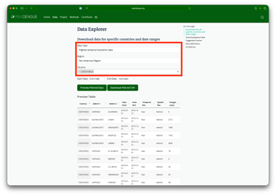
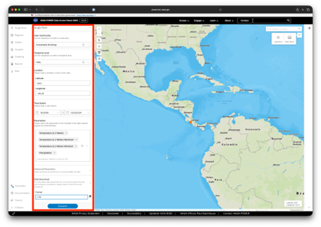

# Análisis de Casos de Dengue y Clima en Costa Rica

Este documento proporciona una guía para interpretar los gráficos generados y un análisis preliminar de los resultados obtenidos en el estudio de la relación entre el clima y los casos de dengue en Costa Rica.
# Paso1
````
python -m pip install --user pandas matplotlib seaborn
````
# Paso2
````
python script.py
````

### Open Dengue



### NASA Power 

